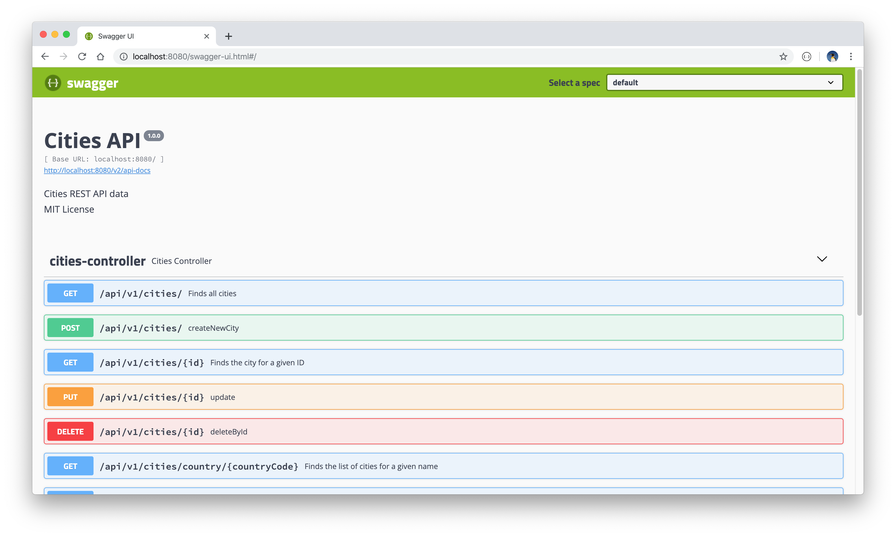
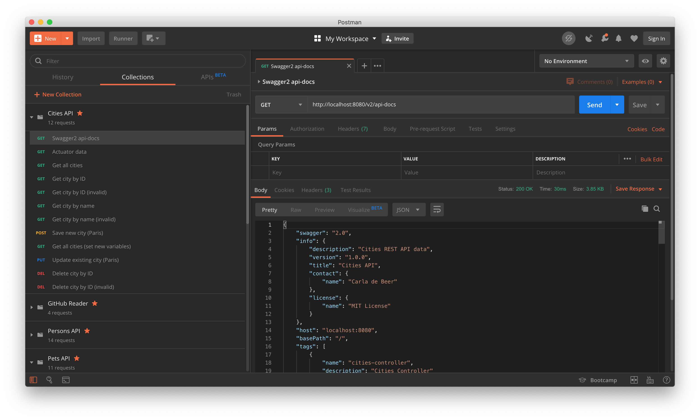
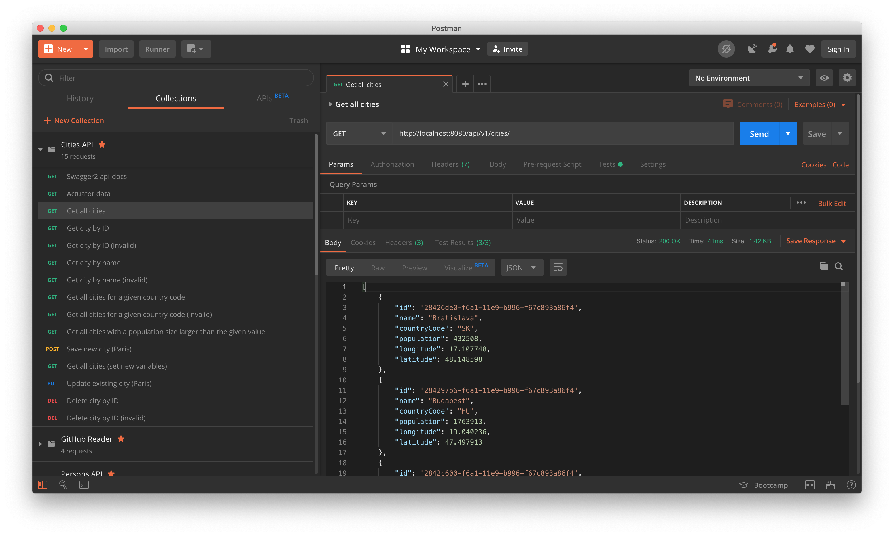

# Cities API
[](https://circleci.com/gh/Carla-de-Beer/cities-api)

This is a Spring Boot API project operating on city-related data. The project allows for connection to either an H2 database (default), or a MySQL database. To change these, comment/uncomment the relevant application properties yml files.

The city data is manipulated by means of standard CRUD calls, together with custom queries.

The project is written in Java 11 and uses Maven as build tool. Swagger2 is used to generate the API documentation. Unit and integration tests are written with JUnit 5 and Mockito. Functional tests are provided by means of the Postman platform.

Continuous integration is achieved through [CircleCi 2.0](https://circleci.com/docs/2.0/). The CircleCi `config.yml` file is configured to run the integration tests with mock MySQL data in the `sql-data/dummy.sql` file.

## Requirements

* Java 11
* Spring Boot 2.2.1.RELEASE
* Maven 3.6.2
* H2/MySQL 8.0.18
* JUnit 5


## Getting started

* Fork or clone the project.
* To generate the MySQL database, tables and users, follow the SQL queries inside the file `src/main/scripts/configure-mysql.sql`. For the H2 database, initial data is read in via the `Bootstrap` class.
* Add a database username and password to the `src/main/resources/application.properties` file.
* Start the project server by running the command `mvn spring-boot:run`.
* The API can be called with any of the following cURL CRUD-based requests (in either JSON or XML formats):

  * GET/READ

    * ```curl -i http://localhost:8080/api/v1/cities/```
    * ```curl -X GET --header 'Accept: application/xml' 'http://localhost:8080/api/v1/cities/'```
    * ```curl -i http://localhost:8080/api/v1/cities/<id>```
    * ```curl -X GET --header 'Accept: application/xml' 'http://localhost:8080/api/v1/cities/<id>'```
    * ```curl -i http://localhost:8080/api/v1/cities/name/<cityName>```
    * ```curl -X GET --header 'Accept: application/xml' 'http://localhost:8080/api/v1/cities/name/<cityName>'```
    * ```curl -i http://localhost:8080/api/v1/cities/country/<countryCode>```
    * ```curl -X GET --header 'Accept: application/xml' 'http://localhost:8080/api/v1/cities/country/<countryCode>'```
    * ```curl -i http://localhost:8080/api/v1/cities/population/<size>```
    * ```curl -X GET --header 'Accept: application/xml' 'http://localhost:8080/api/v1/cities/population/<size>'```

  * CREATE/ADD:

    * ```curl -i -H "Content-Type: application/json" -X POST -d '{"name": "Paris","population": 12532901,"longitude": 0.0, "latitude": 0.0}' http://localhost:8080/api/v1/cities/```

  * UPDATE/EDIT:

    * ```curl -i -H "Content-Type: application/json" -X PUT -d '{"name": "Paris","population": 12532901,"longitude": 48.864716, "latitude": 2.349014}' http://localhost:8080/api/v1/cities/<id>```

  * DELETE:

    * ```curl -i -X DELETE http://localhost:8080/api/v1/cities/<id>```

Alternatively, import and run the Postman test collection. These can be found under `src/test/resources/com/cadebe/cities_api/Postman\ tests/Cities\ API.postman_collection.json`.


## API Documentation

API documentation is provided by means of Swagger2, which can be opened in the browser with the following urls:

* http://localhost:8080/v2/api-docs
* http://localhost:8080/swagger-ui.html#/

<p align="center">
  
  
  
</p>
